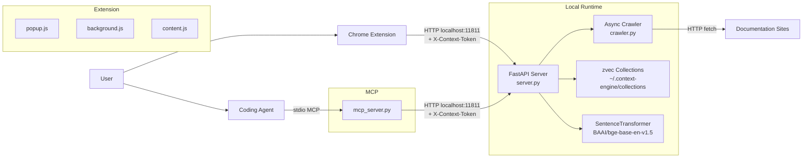
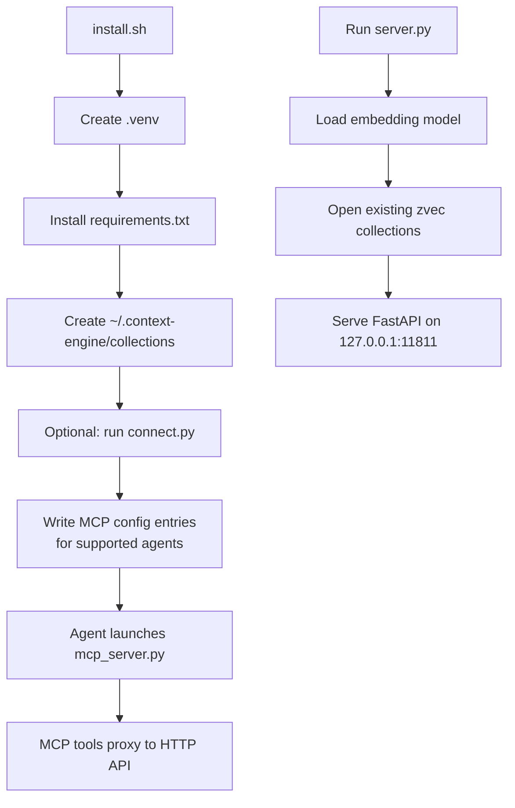
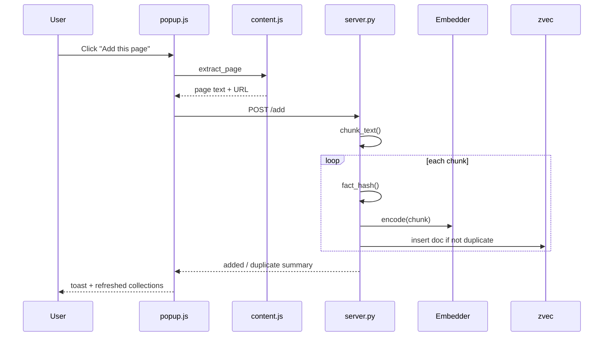
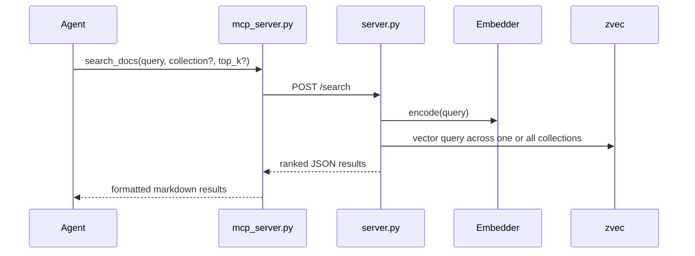
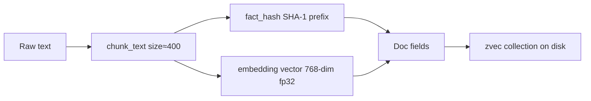
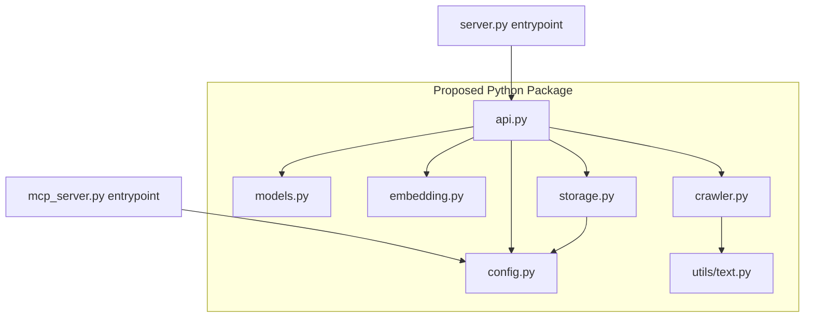

# Context Engine Architecture

## What this project does

Context Engine is a local-first semantic memory system for documentation and notes. It lets a user capture web content through a Chrome extension, index it into per-topic vector collections, and query it later from MCP-compatible coding agents.

At runtime, the project is made of three main surfaces:

1. A local FastAPI server in `server.py`
2. A Chrome extension in `extension/`
3. An MCP bridge in `mcp_server.py`

`connect.py` configures supported coding agents so they can launch the MCP bridge automatically.

## Repository map

| Path | Role |
| --- | --- |
| `server.py` | Main HTTP API, vector storage lifecycle, embedding model loading, crawl orchestration |
| `crawler.py` | Async BFS crawler used by the `/crawl` endpoint |
| `mcp_server.py` | MCP stdio server that proxies MCP tools to the FastAPI server |
| `connect.py` | CLI for wiring the MCP server into agent config files |
| `install.sh` | Bootstraps `.venv`, installs deps, prepares local data directory |
| `extension/manifest.json` | Chrome extension manifest |
| `extension/background.js` | Service worker for context menus and direct API calls |
| `extension/content.js` | Extracts page text and selected text from the current tab |
| `extension/popup.*` | Popup UI for collection management, add-page, add-selection, crawl |
| `requirements.txt` | Python runtime dependencies |

## High-level architecture



## Startup and runtime flow



## Main user flows

### 1. Add current page from the extension



### 2. Search from a coding agent over MCP



### 3. Crawl an entire docs site

```mermaid
flowchart TD
    A[POST /crawl] --> B[Create task_id and in-memory task state]
    B --> C[asyncio.create_task(run_crawl)]
    C --> D[crawler.crawl_site]
    D --> E[Fetch page]
    E --> F[Extract cleaned text]
    F --> G[Chunk content]
    G --> H[Add chunks to collection]
    H --> I[Extract same-domain links]
    I --> J[Queue unseen links]
    J --> K{max_pages reached?}
    K -- no --> E
    K -- yes --> L[Optimize collection and mark task done]
```

## Component responsibilities

### `server.py`

- Owns configuration via environment variables:
  - `CONTEXT_ENGINE_DIR`
  - `EMBED_MODEL`
  - `CONTEXT_TOP_K`
- Loads `SentenceTransformer` during FastAPI lifespan startup.
- Lazily opens or creates zvec collections under `~/.context-engine/collections`.
- Enforces `X-Context-Token` on collection, add, search, and crawl endpoints; `/health` remains unauthenticated for local liveness checks.
- Stores each chunk as:
  - `hash`
  - `text`
  - `source`
  - `agent`
  - `tags`
  - `ts`
  - `source_type`
  - `metadata_json`
  - `embedding`
- Deduplicates writes by SHA-1 hash of normalized text.
- Exposes these endpoints:

| Method | Path | Purpose |
| --- | --- | --- |
| `GET` | `/health` | Server status |
| `GET` | `/collections` | List collections and counts |
| `POST` | `/collections` | Create collection |
| `DELETE` | `/collections/{name}` | Delete collection |
| `POST` | `/add` | Chunk and insert text |
| `POST` | `/search` | Vector search one or all collections |
| `POST` | `/crawl` | Start async crawl task |
| `GET` | `/crawl/{task_id}` | Poll crawl status |

### `crawler.py`

- Performs same-domain BFS crawling.
- Uses `httpx.AsyncClient` with redirect following and a custom user agent.
- Extracts text from `main`, then `article`, then `body`.
- Strips navigation, scripts, and other noisy elements before text extraction.
- Filters discovered links by domain and optional `path_prefix`.
- Writes progress into the mutable in-memory `task_state` object passed by `server.py`.
- Receives `chunk_fn` and `add_fn` from `server.py`, which keeps crawl orchestration explicit but still couples ingestion behavior to the API layer.

### `mcp_server.py`

- Defines a thin MCP server named `context-engine`.
- Proxies requests to `http://127.0.0.1:11811`.
- Exposes three tools:

| Tool | Backing API |
| --- | --- |
| `search_docs` | `POST /search` |
| `list_collections` | `GET /collections` |
| `add_memory` | `POST /add` |

- Formats search results as markdown for agent consumption.

### `connect.py`

- Detects config files for Claude Code, Cursor, VS Code/Copilot, Windsurf, and Claude Desktop.
- Writes MCP config entries pointing to:
  - `.venv/bin/python3`
  - `mcp_server.py`
- Supports:
  - interactive connect flow
  - `--status`
  - `--remove`
  - `--dry-run`
  - per-agent flags and `--all`
- Creates `.bak` backups before overwriting config files.

### `extension/`

#### `popup.js`
- Checks server health.
- Validates and stores the auth token in `chrome.storage.local`.
- Lists and creates collections.
- Stores the active collection in `chrome.storage.local`.
- Adds current page or current selection via `/add`.
- Starts crawls via `/crawl` and polls task progress.
- Shows a dedicated YouTube transcript tool that routes popup actions through the background worker.

#### `content.js`
- Clones the DOM, strips noisy elements, and extracts visible text.
- Returns either full-page text or highlighted selection.

#### `background.js`
- Creates right-click menu entries.
- Sends selected text directly to `/add`.
- Uses `chrome.scripting.executeScript` to extract full-page content for context-menu page capture.
- Keeps the auth token cache in sync with `chrome.storage.local`.
- Orchestrates optional YouTube transcript extraction in the service worker before posting normalized transcript context to `/add`.

## Data model and persistence



### Current storage layout

- Root data directory: `~/.context-engine/`
- Collection directory: `~/.context-engine/collections/{collection-name}/`
- Collection schema:
  - string fields: `hash`, `text`, `source`, `agent`
  - array field: `tags`
  - int field: `ts`
  - string fields: `source_type`, `metadata_json`, `embed_model`
  - vector field: `embedding` (768 dims)

## Important design characteristics

### Strengths

- Very small deployment surface: Python server + browser extension + MCP bridge.
- Local-first by default; no cloud service dependency.
- Clear feature split between ingestion (`/add`, `/crawl`) and retrieval (`/search`).
- Multi-collection storage keeps topics separated without extra infrastructure.
- `connect.py` improves usability by automating MCP agent setup.

### Constraints and risks in the current implementation

1. **Config duplication**  
   Host/port values are repeated in `server.py`, `mcp_server.py`, `background.js`, `popup.js`, docs, and setup output.

2. **Collection compatibility edge cases**  
   The server preserves access to pre-existing collection directories, but schema and embedding-model upgrades still require careful migration handling for older local data.

3. **Tight module coupling**  
   `crawler.py` imports `chunk_text` from `server.py` instead of using a shared utility module.

4. **Ephemeral crawl state**  
   `_crawl_tasks` lives in memory only; restarting the server loses crawl progress and status.

5. **Limited automated verification in-repo**  
   There is now targeted automated coverage for transcript normalization and storage, but the main extension/UI flows still do not have full browser-level end-to-end coverage.

## Suggested improvements

### Highest priority

1. **Centralize configuration**
   - Move host, port, data-dir, model name, and default search size into a shared config module.
   - Reuse that config from server and MCP code.

2. **Expand automated verification**
   - Add browser-level extension tests for popup auth, collection creation, and crawl status handling.
   - Add migration tests for legacy embedding dimensions and legacy collection names.

### Medium priority

3. **Refactor into a package layout**
   - Example split: `config.py`, `storage.py`, `embedding.py`, `api.py`, `crawler.py`, `models.py`.
   - Remove cross-script imports.

4. **Improve crawl job management**
   - Persist job state.
   - Add cancel support.
   - Track failures per URL and expose richer progress metadata.

5. **Unify setup guidance**
   - Ensure `install.sh`, `README.md`, and `connect.py` output use the correct per-agent config schema.
   - Reduce duplicated manual setup snippets.

### Lower priority but worthwhile

6. **Crawler politeness and resilience**
   - Add retry/backoff.
   - Respect `robots.txt` where appropriate.
   - Dedupe queued URLs more aggressively.

7. **Operational observability**
   - Improve structured logging around API calls, crawl tasks, and embedding latency.
   - Return clearer error messages from `mcp_server.py` when the HTTP server is down.

## Recommended next refactor shape



## Bottom line

The project already has a coherent local-first architecture with a simple ingestion path and a practical MCP integration story. The biggest gaps are not feature gaps but hardening gaps: API security, extension permission correctness, shared config, input validation, and test coverage.
